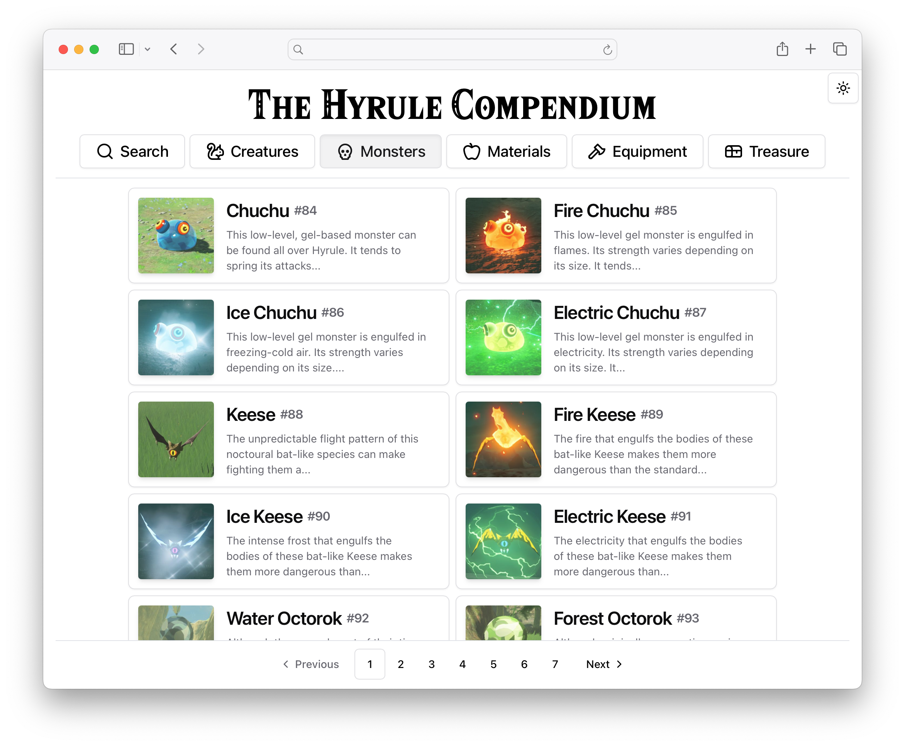

# The Hyrule Compendium 🧝🏻‍♂️

This app displays in-game items from *The Legend of Zelda: Breath of the Wild*.

#### You can view the app live on [GitHub Pages](https://austin-weeks.github.io/Hyrule-Compendium).

<picture>
  
</picture>

## API
The app fetches data from the open-source [Hyrule Compendium API](https://gadhagod.github.io/Hyrule-Compendium-API), which provides information for in-game items and regions from *Breath of the Wild*. The API has excellent documentation and is very easy to work with.

## UI Design
I went with a clean/minimalist design for the app. I've already built a similar project with a more out-there design, (see, [OSRS Stock App](https://austin-weeks.github.io/osrs-ge-app)), so this was a nice change of pace.

The app uses components from [shadcn/ui](https://ui.shadcn.com) and is styled with [Tailwind](https://tailwindcss.com).

## Features
- Smooth Page Transitions
- Dark Mode Support
- Pagination
- Search

## Areas for Improvement

I'm not fully satisfied with my use of pagination for the category pages. If I were to work on the app further, I would probably implement a continuous scroll feature instead.

## Running Locally
<span>1.</span> Clone the repository
```bash
$ git clone https://github.com/austin-weeks/Hyrule-Compendium.git
```
<span>2.</span> Install node dependencies
```bash
$ npm install
```
<span>3.</span> Run the app with Vite
```bash
$ npm run dev
```
